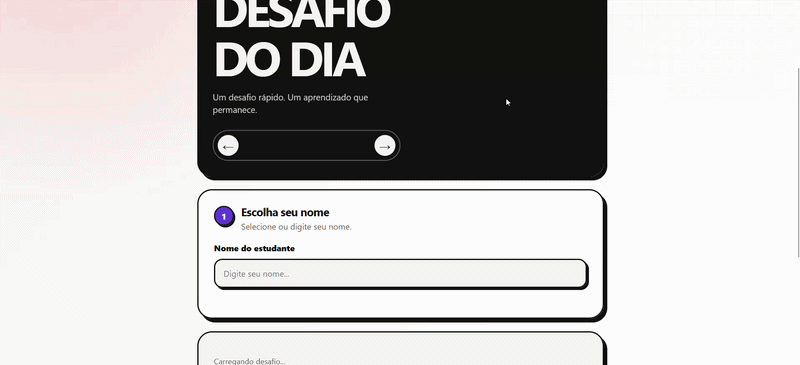

# Projeto: Remake de aplicação web simples




## Acesso

Deploy: [GithubPages](https://elc1090.github.io/project1-2026b-mBrond/)
Repositório: [Github](https://github.com/elc1090/project1-2026b-mBrond)


## Desenvolvedor(a)
Miguel Brondani


## App original

### Links

- Acesso: [Link Original](https://andreainfufsm.github.io/web-challenge-of-the-day/)
- Repositório: [Repositório Original](https://github.com/elc1090/demo-challenge-of-the-day)

### Descrição

A aplicação original é um site em que desafios focados para estudantes são disponibilizados por um administrador, e passível de ser respondido por qualquer um com acesso ao link. O acesso aos dados dos desafios (e estudantes) é feito com JS, com requisições a um Script Google. O Script Google acessa informações de planilhas do Google Sheets. A aplicação original permite responder apenas o desafio do dia atual.

## Demanda do(a) cliente

### Cliente


### Demanda
Usuário conseguir visualizar e completar desafios do dia de dias anteriores, clicando em setinhas para o lado no header do site para navegar entre os dias.

## Desenvolvimento

### Processo

O primeiro passo do desenvolvimento foi compreender o funcionamento geral do sistema, analisando a comunicação entre os arquivos `Code.gs` e `app.js`. Por serem arquivos extensos, utilizei o Gemini para filtrar as funções diretamente relevantes para a demanda. Com o fluxo compreendido, comecei a implementação criando as setas de navegação no HTML e adicionando os eventos visuais no JavaScript para alterar as datas no cabeçalho, inicialmente sem realizar requisições para o backend. 

No arquivo `Code.gs`, identifiquei a função `getBootstrap`, que originalmente era responsável por carregar as configurações da aplicação, a lista de alunos e apenas o desafio do dia atual. Atualizei essa função para aceitar um novo parâmetro opcional referente à data desejada, permitindo buscar dinamicamente o desafio de qualquer dia solicitado. Durante todos os testes, utilizei as ferramentas de desenvolvedor do Firefox (F12) para monitorar as requisições na aba de rede.

Nesse processo de testes, percebi um problema de concorrência: ao clicar rapidamente nas setas de navegação, requisições mais antigas demoravam mais para responder e acabavam chegando depois das mais recentes, sobrescrevendo a tela com informações desatualizadas. Pensei em implementar de uma fila no backend. Reformulei a inicialização da aplicação para que, ao realizar a requisição inicial, uma lista com todas as datas válidas que possuem desafios cadastrados seja recuperada do backend. Com isso, os botões navegam exclusivamente por esse histórico existente, fazendo com que a data de hoje seja a única que eventualmente possa ser exibida sem um desafio associado, além de travar os botões durante o carregamento de cada requisição.

Por ser o meu primeiro contato com o Google Apps Script, essa parte do backend representava o maior desafio do projeto. Para superar essa limitação, busquei tutoriais em vídeo no YouTube e utilizei o Gemini como suporte para compreender a estrutura e a integração das rotas do Script.

Creio que toda a demanda tenha sido atendida.

### Trechos de código

Utilização do elemento <time> para a exibição da data (& #8592; &#8592; e & #8594; &#8594;) para renderizar os símbolos de setas diretamente no navegador.

```HTML
<div class="challenge-date-nav" aria-label="Navegação entre os dias">
        <button type="button" class="date-arrow" id="previous-day" aria-label="Dia anterior">&#8592;</button>
        <time id="challenge-date" datetime=""></time>
        <button type="button" class="date-arrow" id="next-day" aria-label="Próximo dia">&#8594;</button>
      </div>
```
Antes de realizar a requisição à API, os botões são desabilitados e o estado visual é redefinido, garantindo que cliques rápidos não sobreponham respostas antigas na tela.

```JavaScript
async function loadChallengeForCurrentIndex() {
  const targetDate = state.availableDates[state.currentDateIndex];
  if (!targetDate) return;

  renderSelectedDate();
  updateNavigationState();

  previousDayButton.disabled = true;
  nextDayButton.disabled = true;
  challengeEl.innerHTML = `<p class="hint">Carregando desafio...</p>`;

  responseForm.innerHTML = "";
  resetFeedback();
  clearFormMessage();
  submitButton.disabled = true;

  try {
    const bootstrap = await apiGetBootstrapDated(targetDate);
    state.currentChallenge = bootstrap.current_challenge ?? null;

    renderChallenge();
    renderResponseForm();
    resetResponseState();
  } catch (error) {
    console.error(error);
    challengeEl.innerHTML = `
      <p class="error">${escapeHtml(error.message || "Não foi possível carregar o desafio.")}</p>
    `;
    responseForm.innerHTML = "";
    submitButton.disabled = true;
  } finally {
    updateNavigationState();
  }
}
```

Adaptação central das regras de negócio no servidor Google Apps Script. Além de permitir a busca pontual de um desafio por meio do parâmetro de data, a implementação varre as abas do Google Sheets para retornar um array ordenado com todas as datas ativas, servindo como a base de dados que alimenta o fluxo de navegação do frontend

```JavaScript
function getBootstrap_(date) {
  const activeResult = getActiveChallengeResult_(date);

  return {
    success: true,
    app: getConfig_(),
    students: getStudents_(),
    current_challenge: activeResult.challenge,
    current_challenge_key: activeResult.challenge ? activeResult.challenge.id : '',
    message: activeResult.message || '',
    avaible_dates: getAvaibleChallengeDates_(),
  };
}

function getAvaibleChallengeDates_(){
  const sheet = getSheetByName_(SHEET_NAMES.CHALLENGES);
  if (!sheet) return [];

  const rows = getSheetData_(sheet);
  const config = getConfig_();
  const timezone = config.timezone || 'America/Sao_Paulo';

  const dates = new Set();

  rows.forEach(row =>{
    if (isTruthy_(row.active) && row.date){
      const formattedDate = normalizeDate_(row.date, timezone);
      dates.add(formattedDate);
    }
  });

  return Array.from(dates).sort();
}
```

## Tecnologias

### Linguagens e afins

- HTML
- CSS
- JavaScript
- Google App Script

### Ambiente de desenvolvimento

- VS Code
- Gemini
- Firefox

## Referências e créditos

Substitua este trecho por uma lista bem detalhada de todo material que você consultou para ajudar no projeto, por exemplo:  URLs de vídeos ou outro material consultado, créditos para colegas que colaboraram, geradores de código, etc.
- Google Gemini
- Tutoriais disponíveis no Youtube, sem link específico.

---
Projeto entregue para a disciplina de [Desenvolvimento de Software para a Web](http://github.com/andreainfufsm/elc1090-2026b) em 2026b
